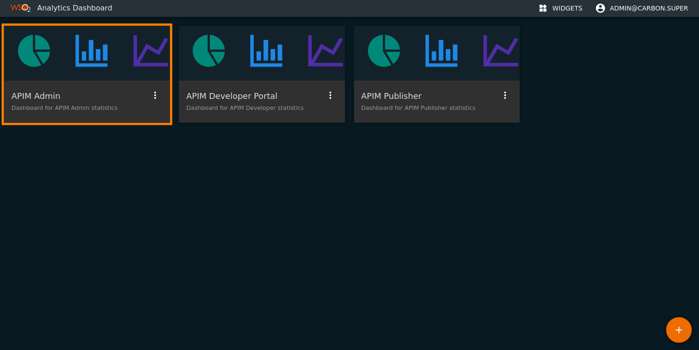
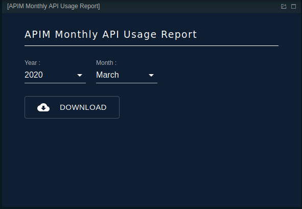
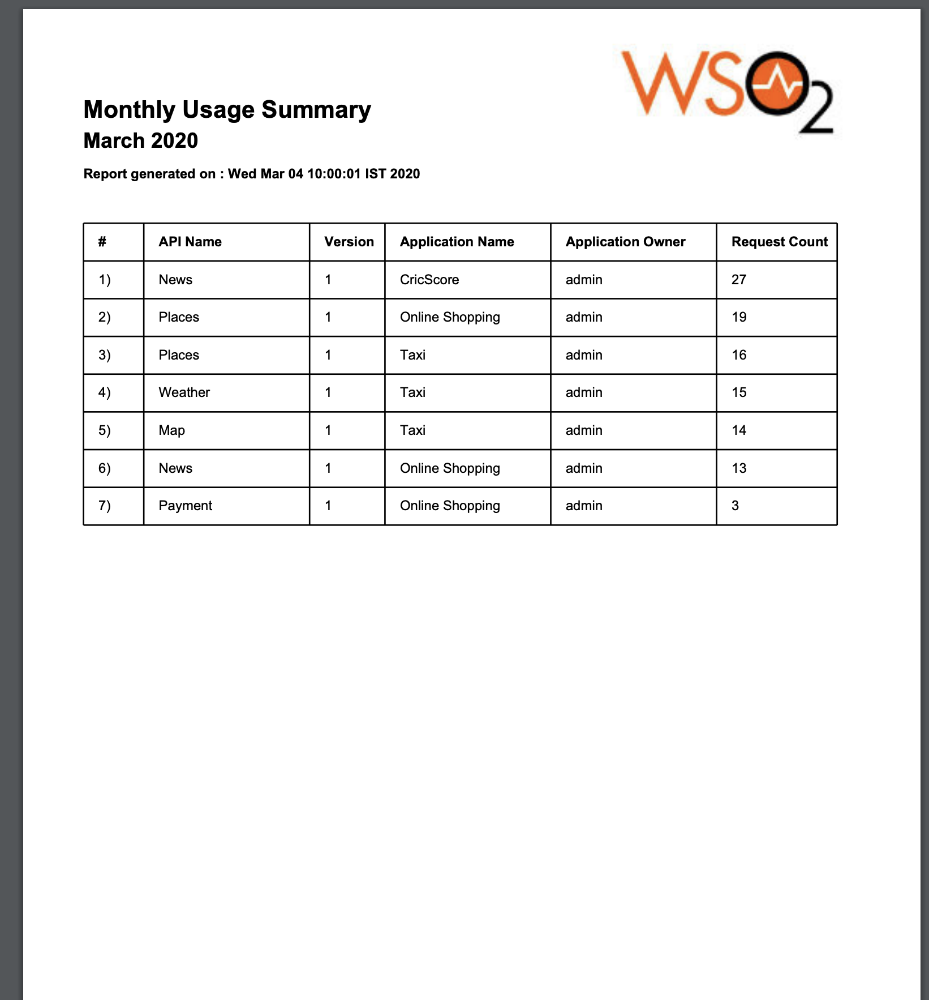

# Monthly API Usage Report
PDF reporting is useful for an organization if reports of API analytics data need to be sent to various stakeholders. This is supported via the Monthly API Usage Report widget which can be accessed through the **APIM Admin** dashboard.



!!! note
    Here the permission to access the **APIM Admin** component of analytics dashboard is only available for users with admin roles.

The following UI widget supports generating a PDF report of a specific year,month combination. The report can be downloaded by clicking on the download button.



The PDF report presents a table with the following information.


            1) API Name
            2) API Version
            3) Application Name
            4) Application Owner
            5) Request Count




##Customizing the Report

The default implementation can be overridden and extended if your organization requires different data than the ones provided by the default report.
This can be achieved by implementing the [ReportGenerator](https://github.com/wso2/analytics-apim/blob/master/components/org.wso2.analytics.apim.rest.api.report/src/main/java/org/wso2/analytics/apim/rest/api/report/api/ReportGenerator.java) interface.
The [default implementation](https://github.com/wso2/analytics-apim/blob/master/components/org.wso2.analytics.apim.rest.api.report/src/main/java/org/wso2/analytics/apim/rest/api/report/reportgen/DefaultReportGeneratorImpl.java) can be used as a reference when implementing the extended version.
A sample customized implementation can be found [here](https://github.com/fazlan-nazeem/custom-report-generator).

Once the implementation is done, the bundle needs to be placed in `{ANALYTICS_HOME/lib}` directory and the `report:implClass` config of the dashboard `deployment.yaml` should be changed to the fully qualified class name of the custom implementation as follows.

```yaml
   report:
   implClass: org.wso2.analytics.apim.custompdf.CustomPDFGenerator
```