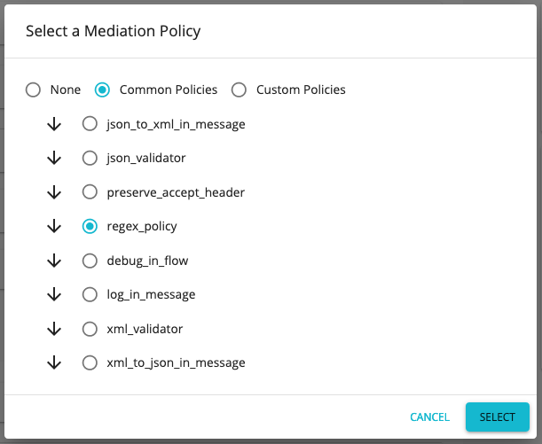

# Regular Expression Threat Protection for API Gateway

WSO2 API Manager provides pre-defined regex patterns to sanitize the request from SQL injection attacks. The attacks 
may depend on the API traffic at runtime. The API developers should identify the common attacks and select the 
appropriate restrictive measures. This feature extracts the data from XML, JSON payloads, Queryparam, URI path, headers 
and validates the content against pre defined regular expressions. If any predefined regex keyword is matched with the 
content, the API request is considered as a threat and it is blocked and rejected. This secures the backend resources 
from activities that make the system vulnerable.  You can configure your own restriction patterns to thwart various 
attacks such as the following:

-   Javascript Injection
-   Server-side Include Injection
-   XPath Injection
-   Java Exception Injection
-   XPath Abbreiviated Syntax Injection

### Blacklisting patterns

We recommend the following patterns for blacklisting.

<table>
    <thead>
        <tr class="header">
            <th>Name</th>
            <th>Patterns</th>
        </tr>
    </thead>
    <tbody>
        <tr class="odd">
            <td>SQL Injection</td>
            <td>
                <code>.*'.*|.*ALTER.*|.*ALTER TABLE.*|.*ALTER VIEW.*|</code><br />
                <code>.*CREATE DATABASE.*|.*CREATE PROCEDURE.*|.*CREATE SCHEMA.*|</code><br />
                <code>.*create table.*|.*CREATE VIEW.*|.*DELETE.*|.*DROP DATABASE.*|</code><br />
                <code>.*DROP PROCEDURE.*|.*DROP.*|.*SELECT.*</code>
            </td>
        </tr>
        <tr class="even">
            <td>Server-side Include Injection Attack</td>
            <td>
                <code>.*#include.*|.*#exec.*|.*#echo.*|.*#config.*</code>
            </td>
        </tr>
        <tr class="odd">
            <td>Java Exception Injection</td>
            <td>
                <code>.*Exception in thread.*</code>
            </td>
        </tr>
        <tr class="even">
            <td>XPath Injection</td>
            <td>
                <code>.*'.*|.*or.*|.*1=1.*|.*ALTER.*|.*ALTER TABLE.*|.*ALTER VIEW.*|</code><br />
                <code>.*CREATE DATABASE.*|.*CREATE PROCEDURE.*|.*CREATE SCHEMA.*|</code><br />
                <code>.*create table.*|.*CREATE VIEW.*|.*DELETE.*|.*DROP DATABASE.*|</code><br />
                <code>.*DROP PROCEDURE.*|.*DROP.*|.*SELECT.*</code>
            </td>
        </tr>
        <tr class="odd">
            <td>Javascript Exception</td>
            <td><p><code>&lt;\s*script\b[^&gt;]*&gt;[^&lt;]+&lt;\s*/\s*script\s*&gt;</code></p></td>
        </tr>
        <tr class="even">
            <td>XPath Expanded Syntax Injection</td>
            <td><p><code>/?(ancestor(-or-self)?|descendant(-or-self)?|following(-sibling))</code></p></td>
        </tr>
    </tbody>
</table>

### Editing the sequence through registry artifacts

To edit the existing sequence follow the steps below.

1.  Log in to the Management Console.
2.  Navigate to `/_system/governance/apimgt/customsequences/in/regex_policy.xml`
3.  Edit the `regex_policy.xml` file.
4.  Go to the API Publisher and re-publish your API for the changes to take effect.

### Applying the Regular Expression Policy

You can apply the pre-defined Regular Expression Policy through the UI. Follow the instructions below to apply the 
regex\_policy in sequence.

1.  Create an API or edit an existing API.
2.  Go to **Message Mediation** Policies under **Request** configurations of the **Runtime Configurations** tab.
3.  Select **Edit** in the message mediation bar and select **Common Policies** .
4.  Select `regex_policy` from the drop-down menu for Common Policies.

    [  ](../../../assets/img/learn/mediation-regex_policy.png)
    
4.  Scroll down the page and click **Save** to save the changes.

Each request is sanitized through the regular expression threat protector. You can add or modify the regex patterns 
according to your requirement.

The regex\_policy sequence is given below.

``` xml
<sequence xmlns="http://ws.apache.org/ns/synapse" name="regex_policy">
    <log level="custom">
        <property name="IN_MESSAGE" value="Regular_expression_policy"/>
    </log>
    <property name="threatType" expression="get-property('threatType')" value="SQL-Injection"/>
    <property name="regex" expression="get-property('regex')" value=".*'.*|.*ALTER.*|.*ALTER TABLE.*|.*ALTER VIEW.*|
        .*CREATE DATABASE.*|.*CREATE PROCEDURE.*|.*CREATE SCHEMA.*|.*create table.*|.*CREATE VIEW.*|.*DELETE.*|.
        *DROP DATABASE.*|.*DROP PROCEDURE.*|.*DROP.*|.*SELECT.*"/>
    <property name="enabledCheckBody" expression="get-property('checkBodyEnable')" value="true"/>
    <property name="enabledCheckHeaders" expression="get-property('enabledCheckHeaders')" value="true"/>
    <property name="enabledCheckPathParams" expression="get-property('enabledCheckPathParams')" value="true"/>
    <class name="org.wso2.carbon.apimgt.gateway.mediators.RegularExpressionProtector"/>
</sequence>
```

!!! note
    If you need to validate only the request headers, you can disable the `enabledCheckBody` and 
    `enabledCheckPathParams` properties by setting the value to `false` .


### Testing the regex threat protector

You can test this feature by sending an SQL injection attack with the XML message body. The sample request and response 
is given below.

``` xml tab="Message"
<?xml version="1.0" encoding="UTF-8"?>
<breakfast_menu>
    <food>
        <name>Homestyle Breakfast</name>
        <price>drop table</price>
        <description>
            Two eggs, bacon or sausage, toast, and our ever-popular hash browns
        </description>
        <calories>950</calories>
    </food>
</breakfast_menu>
```

``` xml tab="Response"
<am:fault xmlns:am="http://wso2.org/apimanager">
    <am:code>400</am:code>
    <am:message>Bad Request</am:message>
    <am:description>SQL-Injection Threat detected in Payload</am:description>
</am:fault>
```

!!! warning
    **Performance impact**  
    The regex mediator builds the entire message and performs string processing to find potentially harmful constructs 
    underneath the message body. This drops the performance of 10KB messages for 300 concurrent users by 3.6 times than 
    the normal flow. The performance decrease may accelerate along with the message size.


