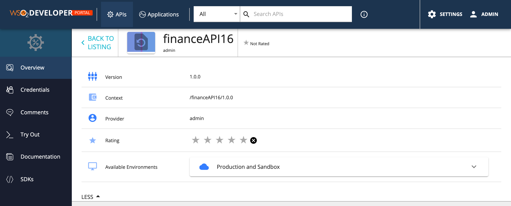
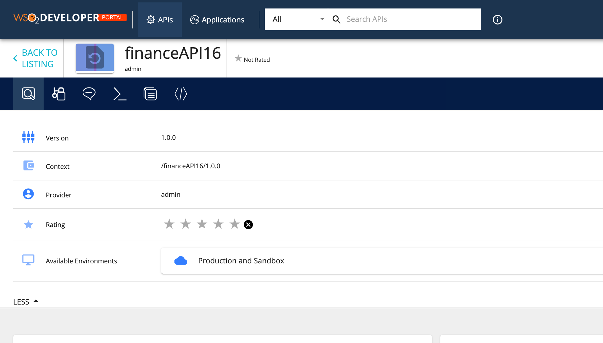
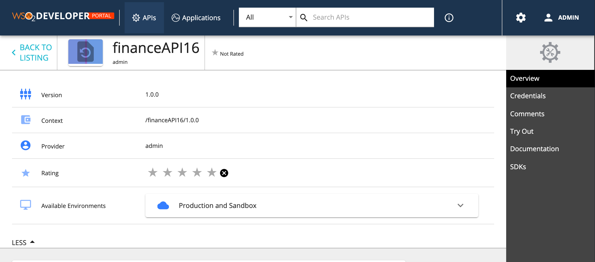

# Styling API Details Left Menu

The API details left menu can be customized to match with your design needs.

  

You can change the themes.light.custom.leftMenu attributes to change the left menu styling. Note these changes will effect the same way to application details left menu.

1. Go to  `<API-M_HOME>/repository/deployment/server/jaggeryapps/devportal/site/public/theme/` directory, open the `defaultTheme.js` file and update `themes.light.custom.leftMenu` attributes.

2. Refresh the Developer Portal to view the changes.

### Following attributes available for leftMenu.

```js
 leftMenu: {
    position: 'vertical-left',
    style: 'icon left',
    iconSize: 24,
    leftMenuTextStyle: 'uppercase',
    width: 180,
    background: '#1a1f2f',
    leftMenuActive: '#254061',
    activeBackground: 'rgb(29, 52, 79)',
    rootIconVisible: true,
    rootIconSize: 42,
    rootIconTextVisible: false,
    rootBackground: '#204d6a',
}
```

Above JSON defines the default look and feel.

We can change the menu to take different positions. For an example following sets the menu as a toolbar by just changing the values of above json as follows.
```js
leftMenu: {
    position: 'horizontal',
    style: 'no text',
    iconSize: 24,
    leftMenuTextStyle: 'uppercase',
    width: 60,
    background: '#051d46',
    leftMenuActive: '#254061',
    activeBackground: '#347eff',
    rootIconVisible: false,
    rootIconSize: 42,
    rootIconTextVisible: false,
    rootBackground: '#204d6a',
}
```

  


Following will set the menu to right hand side and disable the icons.

```js
leftMenu: {
    position: 'vertical-right', // Sets the position of the left menu ( 'horizontal', 'vertical-left', 'vertical-right')
    style: 'no icon', //  other values ('icon top', 'icon left', 'no icon', 'no text')
    iconSize: 24,
    leftMenuTextStyle: 'uppercase',
    width: 180,
    background: '#444',
    leftMenuActive: '#000',
    activeBackground: 'rgb(29, 52, 79)',
    rootIconVisible: true,
    rootIconSize: 42,
    rootIconTextVisible: false,
    rootBackground: '#efefef',
},
```

  

| Option | type | Description |
| ------ | -- | ----------- |
| position | string | Sets the possition of the menu. Accepts 'horizontal', 'vertical-left', 'vertical-right' |
| style | string | Sets the menu icon position and visibility. Accepts'icon top', 'icon left', 'no icon', 'no text' |
| iconSize | integer | Icon size in pixles |
| leftMenuTextStyle | string | Set the font style for the menu text |
| width | integer | Defines the menu width |
| background | string | Set the background for the left menu |
| leftMenuActive | string | Set the background color of the menu when it's selected |
| rootIconVisible | boolean | Set the top Icons visibility. By default set to true, Set it to false to hide it. |
| rootIconSize | integer | Define the size of root icon. The value is considerd in pixels when rendering. |
| rootIconTextVisible | boolean | Set the visibility of the root icon text. By default it's hidden. |
|rootBackground | string | Set the background color of the root icon containing element |

With these configurations, we tried to handle most of the use cases for rebranding. But if someone wants to do a change that is not supported, for an example change the icons or make the menu collapsible, then they need to override the relevant React component. Refer to the [Advanced Customization](advanced-customization.md) for more information.